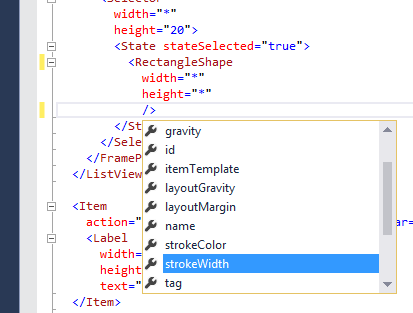

# Home

## Introduction

Unlike many other themable application, where simple resources are replaced, a theme in ExLauncher can change the appearence completely, and also change the flow between screens.

A theme is built using various **views**. The layout is defined in XML files, where a hierarchy of views is built.

## Screens

A screen can be seen as a page. When navigating from one screen to another, the screen will be kept in the screen hierarchy, allowing the user to go back.

## Views

Views are building blocks to layout and build up a screen.

A reference for views and their attributes can be found in the Views page.

Here's a short example how a screen xml file can look like, with the views defining it. In this example, two images are lined up next to each other horizontally.

    <LinearPanel
		width="*"
		height="*"
		orientation="horizontal">
		<Image
			width="32"
			height="32"
			path="@theme/myImage.png" />
		<Image
			width="32"
			height="32"
			path="@theme/myImage2.png" />
	</LinearPanel>

For more examples, see Examples.

## XML Schema

If you reference the XML schema screen.xsd and you use a decent XML / text editor, you can get some assistance when writing the XML files.

