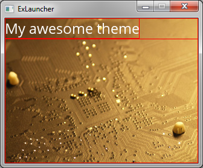
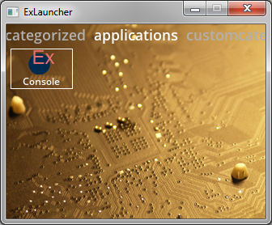

# Tutorial

## Theme with two screens

### Creating the theme files

Create a new folder in the themes directory. The name of the folder is your theme's ID and it's recommended to name it in lowercase using only a-z and 0-9.

Inside the new folder, create the file theme.xml. Use the following content as a starting point and edit as you wish.

	<?xml version="1.0" encoding="utf-8"?>
	<Theme>
	  <Name>My Theme</Name>
	  <EntryPoint>start.xml</EntryPoint>
	  <Author>The Author</Author>
	  <Copyright>Copyright (c) The Author year</Copyright>
	  <License>CC Attribution 4.0</License>
	  <ThirdPartyDeclarations>
		<ContentDeclaration>Any credits or license for third party content</ContentDeclaration>
		<ContentDeclaration>Multiple content declaration can be used</ContentDeclaration>
	  </ThirdPartyDeclarations>
	</Theme>

Now, for the theme to actually work, we need to have an entry point. You define the name of you entry point in theme.xml.

In this tutorial I will go with start.xml. Create your entry point xml and use the following as your entry point.

	<?xml version="1.0" encoding="utf-8"?>
	<LinearPanel
	  xmlns="http://schemas.exlauncher.com/exlauncher"
	  xmlns:xsi="http://www.w3.org/2001/XMLSchema-instance"
	  xsi:schemaLocation="http://schemas.exlauncher.com/exlauncher ../../schema/screen.xsd"
	  width="*"
	  height="*">

	</LinearPanel>

Now start ExLauncher with the command line argument `--theme=yourthemeid`. You should see a blank screen showing only a background image.

### Adding views

Now it's time to actually build theme.

Let's start by adding a text label to the LinearPanel. The view name for a text label is `Label`.

	<?xml version="1.0" encoding="utf-8"?>
	<LinearPanel
	  xmlns="http://schemas.exlauncher.com/exlauncher"
	  xmlns:xsi="http://www.w3.org/2001/XMLSchema-instance"
	  xsi:schemaLocation="http://schemas.exlauncher.com/exlauncher ../../schema/screen.xsd"
	  width="*"
	  height="*">

	  <Label
		width="wrap_content"
		height="wrap_content"
		text="My awesome theme"
		textSize="24"
		textColor="white"
		font="regular" />

	</LinearPanel>

You may notice that the linear panel and the label use different values for width and height. The linear panel uses a star, which means it will size itself so that it fills its parent. As the linear panel already is highest in the hierarchy, it will fill the screen.

The label instead uses **wrap_content**, which means it will have the size of its content. In other words, the size will be just large enough to display the text in it.

Next up we want to show categories of apps for the user to select. For this tutorial we will use a simple list for this purpose.

The list view also requires another attribute, **itemSize**. If the orientation of the list is vertical, itemSize is the row height, and if the orientation is horizontal, it's the column width. One more change required is to set the LinearPanel orientation to vertical.

	<?xml version="1.0" encoding="utf-8"?>
	<LinearPanel
	  xmlns="http://schemas.exlauncher.com/exlauncher"
	  xmlns:xsi="http://www.w3.org/2001/XMLSchema-instance"
	  xsi:schemaLocation="http://schemas.exlauncher.com/exlauncher ../../schema/screen.xsd"
	  width="*"
	  height="*"
	  orientation="vertical">

	  <Label
		width="wrap_content"
		height="wrap_content"
		text="My awesome theme"
		textSize="24"
		textColor="white"
		font="regular" />

	  <ListView
		width="*"
		height="*"
		orientation="vertical"
		itemSize="40" />

	</LinearPanel>

When you run your theme it will look exactly the same as before. This is because we don't have anything in the list yet.

If you want to check and see that the list view is actually there, you can see outlines of views by launching ExLauncher with `--debugViewBounds`.

### The itemTemplate

To add categories we could just hard code 4 list items; games, emulators, applications and settings. However, this is a bad idea, since there could exist more categories we don't know about.
So what we're going to do is tell ExLauncher to fill our list for us.

But when filling, ExLauncher needs to know how we want each list entry to look like, and that's what itemTemplate is there for.

Let's create a new file, called categoryTemplate.xml.

For now, let's keep it simple, and only use a Label.

    <?xml version="1.0" encoding="utf-8"?>
    <Label
      xmlns="http://schemas.exlauncher.com/exlauncher"
      xmlns:xsi="http://www.w3.org/2001/XMLSchema-instance"
      xsi:schemaLocation="http://schemas.exlauncher.com/exlauncher ../../schema/screen.xsd"
      width="*"
      height="*" />
      
However, we need a way of specifying the title of each category. This can done with setting the *text* attribute to **{categoryName}**, like the following:

    <?xml version="1.0" encoding="utf-8"?>
    <Label
      xmlns="http://schemas.exlauncher.com/exlauncher"
      xmlns:xsi="http://www.w3.org/2001/XMLSchema-instance"
      xsi:schemaLocation="http://schemas.exlauncher.com/exlauncher ../../schema/screen.xsd"
      width="*"
      height="*"
      text="{categoryName}" />
      
**{dataVariable}** tells ExLauncher to replace it with whatever information is specified for the key dataVariable, in this case, the category name.

If you launch ExLauncher with these changes, it will still look the same as before. To change this we must now make use of the template and tell ExLauncher what data should be filled. 

### Filling the list

The next step is to tell ExLauncher to use the template. This can be done by specifying the attribute **itemTemplate** on the ListView and have it reference our new categoryTemplate.xml. Add the following:

`itemTemplate="@theme/categoryTemplate.xml"`

Almost done. The last missing puzzle piece is to instruct ExLauncher what to fill. For this, we tag the view to fill with the available categories. Add the following to the ListView:

`tag="fillCategories"`

If everything was added correctly, it should now look like this:

### Adding input / selection

The list is now populated correctly, but we need a way to select an entry, and also show which entry is currently selected.

To show an item as selected, we have to rely to states. With states we can show or hide different part of the view hierarchy depending on the state, in this case whether an item is selected or not.

One first change we have to do to the template is to wrap the label inside a **FramePanel**.

    <?xml version="1.0" encoding="utf-8"?>
    <FramePanel
      xmlns="http://schemas.exlauncher.com/exlauncher"
      xmlns:xsi="http://www.w3.org/2001/XMLSchema-instance"
      xsi:schemaLocation="http://schemas.exlauncher.com/exlauncher ../../schema/screen.xsd"
      width="*"
      height="*">

      <Label
        width="*"
        height="*"
        text="{categoryName}" />

    </FramePanel>
    
This is because the item template expects only one direct child view, and we want to have multiple views. A FramePanel is a view that shows all its children on top of each other, which is perfect if we want to show a selection rectangle.

A state is hosted inside a Selector. The selector works basically as a FramePanel on its own. Add the following just above the Label, to get a white selection rectangle:

    <Selector
      width="*"
      height="*">
      <State stateSelected="true">
        <RectangleShape
          width="*"
          height="*"
          strokeColor="white" />
      </State>
    </Selector>
    
Children added to a FramePanel will be drawn in the order they are added. This means that by putting the selection rectangle before the Label, the Label will be drawn on top. In this case it doesn't matter, since the rectangle doesn't have any background, but it would matter if it did. Feel free to experiment with this. A background can be added to the RectangleShape with the attribute **fillColor**.

There is one final step to make the selection work. When ExLauncher determines what view to use for input, it searches the view hierarchy for a view with the ID **inputView**. Set the ID of our ListView to inputView by adding:

`id="inputView"`

If done correctly, it should now look like the following:

Move the selection by pressing up / down.

### The app screen

There's still one thing left to make this theme usable, and that is to show actual apps and let the user launch them. This will be done rather quickly, since it's variation of the things above and you probably start getting a hang of the basics.

This time we'll make use of the GridView. It's very similar to the ListView, except in this case we need more than one item size value. The attributes here are called **itemWidth** and **itemHeight**.

Create the new files apps.xml and appTemplate.xml. The apps screen will show all the apps for each category.

apps.xml

    <?xml version="1.0" encoding="utf-8"?>
    <GridView
      xmlns="http://schemas.exlauncher.com/exlauncher"
      xmlns:xsi="http://www.w3.org/2001/XMLSchema-instance"
      xsi:schemaLocation="http://schemas.exlauncher.com/exlauncher ../../schema/screen.xsd"
      id="inputView"
      width="*"
      height="*"
      itemWidth="106"
      itemHeight="50"
      orientation="vertical"
      tag="fillItems"
      itemTemplate="@theme/appTemplate.xml">
    </GridView>
    
appTemplate.xml

    <?xml version="1.0" encoding="utf-8"?>
    <FramePanel
      xmlns="http://schemas.exlauncher.com/exlauncher"
      xmlns:xsi="http://www.w3.org/2001/XMLSchema-instance"
      xsi:schemaLocation="http://schemas.exlauncher.com/exlauncher ../../schema/screen.xsd"
      width="*"
      height="*">

      <Selector
        width="*"
        height="*">
        <State stateSelected="true">
        <RectangleShape
          width="*"
          height="*"
          strokeColor="white" />
        </State>
      </Selector>

      <LinearPanel
        width="*"
        height="wrap_content"
        orientation="vertical"
        layoutGravity="center_horizontal"
        layoutMargin="0 2 0 0">
        <Image
          width="32"
          height="32"
          layoutGravity="center_horizontal"
          path="{iconId}" />
        <Label
          width="*"
          height="wrap_content"
          text="{name}"
          gravity="center_horizontal"/>
      </LinearPanel>
    </FramePanel>
    
Note that it's a good idea to let the app icon be a set size. Even though app icons should always be in a specific size, in practice it may differ.
    
Now that we have a screen for apps, we need to go to that screen when the user selects something in the first screen. This is done by adding an action to the category item template. Open up categoryTemplate.xml and add the following attribute to the topmost FramePanel:

`action="screen:@theme/apps.xml"`

You might notice that we never defined an action for the apps. There is no need to define an action for apps, ExLauncher already knows how to deal with them.

When running ExLauncher with these changes, and selecting a category in the first screen, the following should show up (depending on what test app data is available):

There is a problem here though, regardless what category you selected, apps from all categories are present. Continue on to see how this is solved.

### Passing data betweens screens

To only show apps from certain categories, we can extend the tag of the input view to:

`tag="fillItems|categories=mycategory"`

However, in the apps screen, we don't know which category the user pressed. We need to pass this data from the start screen to the apps screen.

To do this, we have to modify the action of the categoryTemplate. Change it into the following:

`action="screen:@theme/apps.xml:category={category}`

This sends the variable *category* to the apps screen. You could send a specific value for this variable if you wish, but in this case we want to send the chosen category, and we don't know that value, since the category template is used for all categories. So we fill with the value *category* in the same way as we used the *categoryName* previously.

Finally we have to pick up this variable in the apps screen. Go to the apps.xml file and change the tag to:

`tag="fillItems|categories={category}"`

This will set the apps to be filled to a specific category, pointed out by the variable *category* that we passed from the start screen.

When you now start ExLauncher and pick a category, only apps from the certain category should be shown. For example, for the category applications, it might look like the following:

That concludes our first tutorial. So where to go from here? For a start, the theme isn't very nice looking. Explore the view reference to find out what can be changed and tuned, or see the examples section. Keep reading for a tutorial on tabs.

## Tab based theme (including XAML-style attributes)

The second tutorial will expect that you have read the first tutorial already.

### The TabPanel

The TabPanel displays tabs to switch between for example different categories, in a single screen. The tabs themselves are currently not customizable, and will use the name of the child as the tab title.

Create the theme.xml file as was done in the first tutorial, and create a screen xml with the tab panel as following:

    <?xml version="1.0" encoding="utf-8"?>
    <TabPanel
      xmlns="http://schemas.exlauncher.com/exlauncher"
      xmlns:xsi="http://www.w3.org/2001/XMLSchema-instance"
      xsi:schemaLocation="http://schemas.exlauncher.com/exlauncher ../../schema/screen.xsd"
      id="inputView"
      width="*"
      height="*"
      tag="fillCategories">
    </TabPanel>
    
If you launch ExLauncher now, you will notice that it doesn't work yet, since we haven't added any item template, so ExLauncher doesn't know what to fill with.

### XAML-style attributes

To add an itemTemplate we could create a new xml file and reference that in the tab panel, similar to what we did before. But we can also embed the item template in the same xml like the following:

    <?xml version="1.0" encoding="utf-8"?>
    <TabPanel
      xmlns="http://schemas.exlauncher.com/exlauncher"
      xmlns:xsi="http://www.w3.org/2001/XMLSchema-instance"
      xsi:schemaLocation="http://schemas.exlauncher.com/exlauncher ../../schema/screen.xsd"
      id="inputView"
      width="*"
      height="*"
      tag="fillCategories">

      <TabPanel.ItemTemplate>
        <GridView
          id="inputView"
          width="*"
          height="*"
          orientation="vertical"
          itemTemplate="@theme/appTemplate.xml"
          itemWidth="77"
          itemHeight="50"
          layoutMargin="0 0 5 5"
          verticalSpacing="8"
          contentInset="0 5" />
      </TabPanel.ItemTemplate>

    </TabPanel>
    
This style of defining attributes is only supported for a few attributes, such in this case, the *itemTemplate* attribute.

Note that for a tab panel, an item template means the content behind a tab, not the tab itself. The tabs themselves will be customizable in a later release.

Use the appTemplate.xml you created in the first tutorial, and it should look like this:

You may notice that the ID *inputView* is used both in the tab panel and in the child. Usually you don't want to use the same ID twice, but in this case, the tab panel will look for the input view within each child.

### Hardcoding tabs

To show what kind of things you can do when working item templates and tab panels, let's make one of the tabs different, and use a ListView instead of a GridView. We'll do this for the games category.

Add the following child to the tab panel. It can be added above or below the tab panel item template, it makes no difference.

    <ListView
      name="games"
      id="inputView"
      width="*"
      height="*"
      orientation="vertical"
      itemSize="30"
      layoutMargin="0 0 5 5"
      contentInset="0 5">

      <ListView.ItemTemplate>
        <Label 
          width="*"
          height="wrap_content"
          layoutGravity="center_vertical"
          text="{name}" />
      </ListView.ItemTemplate>
        
    </ListView>
    
When starting ExLauncher, you will be notice the difference between *games* and *applications*:

 

There is no selection rectangle for the list, because this was not added to keep the example simple, so this is left as an exercise for the reader.

An important thing to note in this new hard coded tab is that the *name* attribute is set to games. When a game app is filled into the tab panel, it will search for a tab named games, and insert it there. 

This concludes the second tutorial.