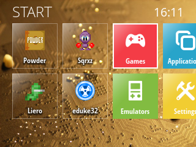
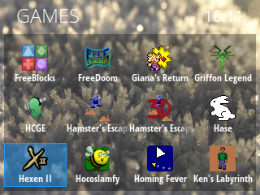

ExLauncher
==========

ExLauncher is a launcher / menu system for devices with gamepad like controls. It is originally developed for the **GCW Zero**, but should work on other devices with SDL2 as well.
It supports highly customizable themes / skins, where the layout can be radically different. To learn how to create themes, see [the theming documentation](https://exlauncher.org/theming/).

 

# Contributors welcome

While the base program works and is usable, much is left to be done for it to really shine.
This is where you come in! Contributions are needed in many different areas.

For any contribution, feel free to open a PR. For graphical updates to the main theme or larger code changes, it might be a good idea to show or talk to me first, to avoid doing unneccessary work. Also talk to me if you would like to have commit access. I can be reached at my github username @gmail.com.

Here is a list of some suggested improvements to be done, but there are of course more things to improve.

### Theme improvements
The default theme could use some improvements to the design, especially most pages that are not the start page. It would also be nice to bundle some more themes with it.
### Settings
More settings would certainly be nice to have.
### Console mode
Apps and games requiring the console does not run at the moment.
### Localization
A system for translations would be a good feature to have for our users who prefer their own language instead of English.
### Animation system
To make ExLauncher look really nice, some additional animations would help. The ideal solution would be a system where animations can be defined for certain actions directly on views in the XML. For example, on selection or on leaving a page.
### And more
Bugs, other missing features, feature parity with other menus, etc...

